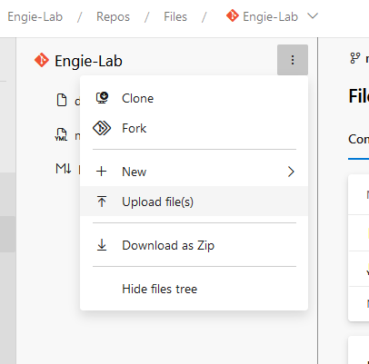

#### Import your application

In order to move forward, you need to import the source code in your Azure DevOps project. You normally have a dedicated project on [https://dev.azure.com/gems-training](https://dev.azure.com/gems-training). This repository will be used for the different parts of this workshop.

Import the downloaded files (hello-world.zip) to your repository. You can either upload them manually or doing it properly with Git.

> Note: you only need to upload the nodejs folder but you may need to add files later so start to think about the directory tree.







#### Create a build pipeline

Creating a build pipeline in software development offers several advantages, which contribute to more efficient and reliable software development processes. Here are some of the key benefits:

- **Automation**: Build pipelines automate the process of compiling, testing, and deploying code. This reduces the need for manual interventions, leading to faster and more consistent builds.

- **Consistency**: Build pipelines ensure that every code change goes through the same set of steps, which leads to consistent build and deployment processes. This consistency reduces the chances of human error.

- **Reliability**: With automated testing and deployment processes, the reliability of your software increases. This helps catch issues early in the development cycle, reducing the risk of defects reaching production.

- **Scalability**: Build pipelines can be easily scaled to accommodate larger development teams and more complex projects. This allows for the efficient management of various branches, environments, and configurations.

- **Reproducibility**: Build pipelines enable the easy reproduction of any previous build or release. This is vital for troubleshooting and debugging issues because you can easily recreate the exact state of the software at a specific point in time.

- **Continuous Integration (CI)**: Build pipelines are a fundamental part of CI, allowing developers to integrate their code changes into the main repository frequently. This encourages collaboration, early bug detection, and faster development cycles.

- **Faster Feedback**: Automated testing within the pipeline provides quick feedback to developers. This means that if a code change introduces a problem, developers can identify and address it sooner rather than later.

- **Version Control Integration**: Build pipelines often integrate with version control systems like Git, ensuring that only approved changes are built and deployed.

- **Deployment Flexibility**: Depending on the pipeline's configuration, you can deploy software to various environments, such as development, staging, and production. This flexibility is crucial for testing and minimizing the impact of changes on end-users.

- **Security**: By including security checks in the build pipeline, you can catch vulnerabilities and security issues early in the development process, reducing the risk of deploying insecure software.

- **Cost-Efficiency**: Automation reduces the time and effort required for each build and deployment, ultimately lowering operational costs and freeing up resources for other tasks.

- **Monitoring and Metrics**: Build pipelines often provide insights and metrics about the success and performance of each build and deployment, allowing teams to make data-driven decisions for improvement.

- **Documentation**: A well-structured build pipeline serves as documentation for the software's build and deployment processes. This is especially useful for onboarding new team members and maintaining institutional knowledge.

- **Continuous Delivery (CD)**: When combined with a CD pipeline, the build pipeline enables a continuous, automated delivery process, allowing for rapid and reliable software releases.

In summary, build pipelines are essential in modern software development as they contribute to faster, more reliable, and efficient development processes. They promote automation, consistency, and collaboration while reducing the risk of errors and improving the overall quality of the software being developed.

You are now asked to create a build pipeline based on the source code you just downloaded. **The pipeline must be able to build a docker image**.

For this exercice, you are allowed to create a classic pipeline (WYSIWYG) or a yaml pipeline (pipeline as code), as long as it works. In the GEMS context, you are asked to use buildkit to create your image.



Since we do the build inside the docker file, we only need one step, one to build the docker image or at GEMS, you can use buildkit

**Using Buildkit**

```yaml
trigger:
- main

resources:
- repo: self

variables:
  tag: '$(Build.BuildId)'

stages:
- stage: Build
  displayName: Build image
  jobs:
  - job: Build
    displayName: Build
    pool: k8s-build-agents
    steps:
    - bash: |
        buildctl --addr tcp://buildkitd:1234 build \
        --frontend dockerfile.v0 \
        --local context=. \
        --local dockerfile=. \
        --opt build-arg:http_proxy=http://proxy-az.infrasys16.com:3128 \
        --opt build-arg:https_proxy=http://proxy-az.infrasys16.com:3128 \
        --opt build-arg:HTTP_PROXY=http://proxy-az.infrasys16.com:3128 \
        --opt build-arg:HTTPS_PROXY=http://proxy-az.infrasys16.com:3128 \
        --opt build-arg:build_id=someway-$(Build.SourceBranchName):$(Build.BuildId) \
        --opt filename=./Dockerfile \
        --output type=docker,name=registry.gem.myengie.com/gemarc/hello-world-$(Build.SourceBranchName):$(Build.BuildId) | podman load
      displayName: Building image

```

**Using Docker build**

``` yaml
trigger:
- main

resources:
- repo: self

variables:
  tag: '$(Build.BuildId)'

stages:
- stage: Build
  displayName: Build image
  jobs:
  - job: Build
    displayName: Build
    pool: k8s-build-agents
    steps:
    - task: Docker@2
      displayName: Build an image
      inputs:
        command: build
        dockerfile: '$(Build.SourcesDirectory)/nodejs/dockerfile'
        tags: |
          $(tag)
```


