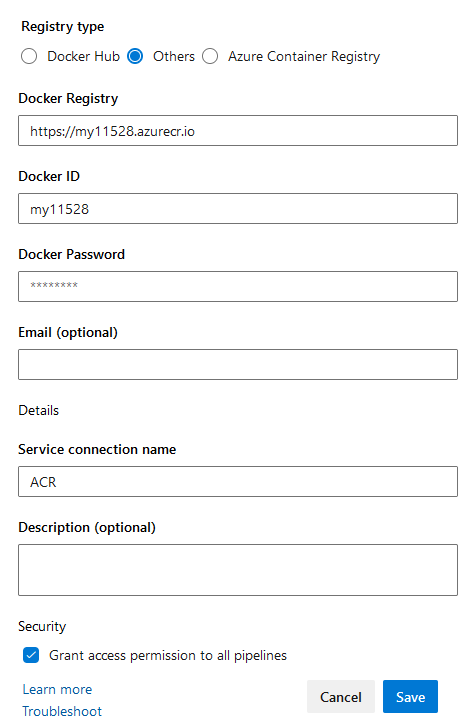

#### Publish your container image

To deploy a docker image, you first need to publish it a container registry. On Azure, the solution is Azure Container Registry but you may also decide to use an alternative such as [Harbor](https://goharbor.io) or [Artifactory](https://jfrog.com/fr/artifactory/) if your company use them.

Add steps to your pipeline to push your images to your registry.



With Docker

``` bash
docker login <url-registry>

docker tag <image-name>[:TAG] <container-registry-IP>/<project-name>/<image-name>[:TAG]

docker push <container-registry-IP>/<namespace-name>/<image_name>
```

With Podman

``` bash
podman push --creds='$(REGISTRY_CREDS)' $(REGISTRY)/aks-training/studentXXX-$(BUILD_ID)
```

With the Azure DevOps Docker task

```yaml
- task: Docker@2
      displayName: Build an image
      inputs:
        containerRegistry: 'ACR' #  you need to create a docker service connection
        repository: 'studentXXX' # your student name
        command: 'buildAndPush' # build AND push
        Dockerfile: $(Build.SourcesDirectory)/dockerfile
        tags: '$(tag)'
```

To create the service connection, go in your Azure DevOps project settings and add a **Docker Registry** service connection. Normally we would use a Azure Container Registry with a service principal, but for simplification, we are going to connect using Docker credentials (provided by your trainer)





> Warning: never forget that using latest tag is [most of the time a very bad practice](https://vsupalov.com/docker-latest-tag/). It's not mandatory in the lab but you should find a way to have an incremental tag number.
