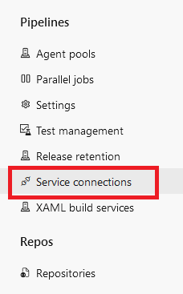
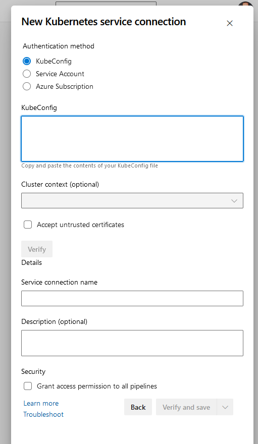

### Create a manifest

You need a deployment manifest file to deploy your application. The manifest file allows you to define what type of resource you want to deploy and all the details associated with the workload.

Kubernetes groups containers into logical structures called pods, which have no intelligence. Deployments add the missing intelligence to create your application.

Create a deployment file which matchs the following requirements:

- deploy your application with only one replica
- set the environment variable GREETEE to AKS
- set requests with CPU = 100m and Memory = 128Mi



Create a deployment.yaml file with the following contents, and make sure to replace **<registry-fqdn>** with the fully qualified name of your registry:

```` yaml
# deployment.yaml
apiVersion: apps/v1
kind: Deployment
metadata:
  name: webapp
spec:
  selector: # Define the wrapping strategy
    matchLabels: # Match all pods with the defined labels
      app: webapp # Labels follow the `name: value` template
  template: # This is the template of the pod inside the deployment
    metadata:
      labels:
        app: webapp
    spec:
      nodeSelector:
        kubernetes.io/os: linux
      containers:
        - image: <registry-fqdn>/webapp # Registry + image name
          name: webapp
          resources:
            requests:
              cpu: 100m
              memory: 128Mi
          ports:
            - containerPort: 80
              name: http
          env:
            - name: GREETEE
              value: AKS
````



### Connect to your cluster

To deploy an application within a cluster, you need to authenticate as a user who has enough rights (*[userRole](https://kubernetes.io/docs/reference/access-authn-authz/rbac/)*) to create your objects (pods, services, etc.).

In your case, authorization is managed by Rancher. You must get your credentials using the Rancher portal and download your *kubeconfig* file.

INSERER SCREENSHOT de PIERRE

Once your h

You can reuse it in your pipeline in different ways, some are better than others. Think and choose wisely:

- you could add the kubeconfig in the git repository and use the --file parameter from kubectl command
- you could inject the kubeconfig in a global variable and use it to recreate a kubeconfig during execution
- you could create a [service connection](https://colinsalmcorner.com/azure-pipelines-for-private-aks-clusters/#create-a-generic-k8s-endpoint) which allow to securely connect to a resource.



The cleanest way is to create a service connection which will be injectected in your pipeline.

> Note If your company does not use Rancher, the simplest way to get your kubeconfig file is to use the az aks get-credentials command and reuse the generated kubeconfig file

```` cli
    # login to azure
    az login
    
    # login to the AKS cluster
    az aks get-credentials -n <cluster_name> -g <cluster_resource_group_name>
````

To create a Service Connection, in the settings of your Azure DevOps project and click on "Service connections"



From there, create a kubernetes service connection based on kubeconfig.





### Add deployment steps in your pipeline


### Check you deployed application

Connect to your cluster and ensure the deployment is successful. Once done, get the name of the pod.

```sh
kubectl get deploy webapp
```

You should see an output similar to:

```sh
NAME              READY   UP-TO-DATE   AVAILABLE   AGE
webapp            0/1     1            0           16s
```



Use `kubectl get pods` to check if the pod is running. Obtain the name of the created pod.

```sh
kubectl get pods
```

You should see an output similar to:

```sh
NAME                               READY   STATUS    RESTARTS   AGE
webapp-7c58c5f699-r79mv            1/1     Running   0          63s
```


