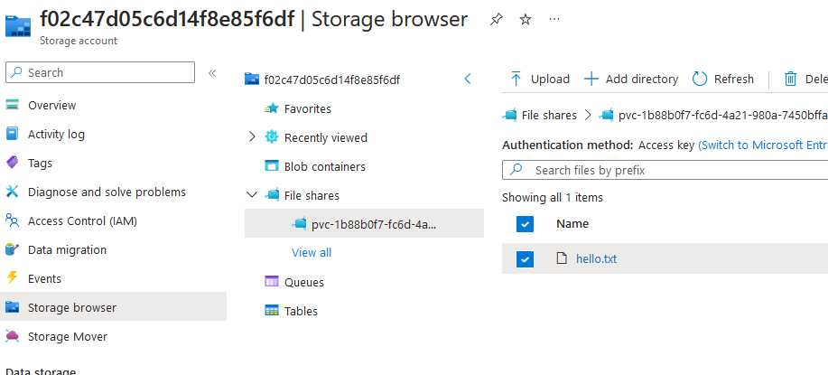

Some containerized applications may require storing files on the disk. They could use temporary storage (but it would disappear on next pod "restart") or they could require retaining the data. In such a use case, you have three choices:

- write on a network share
- write using SDK but it implies to modify your code (i.e. SDK to write a blobstorage)
- write on a local mount which points to a storage system

You are going to use the last one in order to cover the case where the application code cannot be modified or when you want to remain agnostic from the Cloud provider.

You are going to use two concepts:

- The [PVC (PersistentVolumeClaim)](https://kubernetes.io/docs/concepts/storage/persistent-volumes/#persistentvolumeclaims): which defines the requirements of your application
- The [StorageClass](https://kubernetes.io/docs/concepts/storage/storage-classes/): which defines the underlying storage technology

List the available **StorageClass** in your cluster with the `kubectl` command. Try to keep in mind the name of the storage class related to Azure Files.



Simply list the StorageClass objects

```bash
kubectl get storageclass
```

You should obtain something like this. It depends on the storageclass present by default in your cluster, either added by the Cloud provider or by the administrator. You can of course add additional classes.

```bash
[ ~ ]$ kubectl get storageclass
NAME                    PROVISIONER          RECLAIMPOLICY   VOLUMEBINDINGMODE      ALLOWVOLUMEEXPANSION   AGE
azurefile               file.csi.azure.com   Delete          Immediate              true                   2d1h
azurefile-csi           file.csi.azure.com   Delete          Immediate              true                   2d1h
azurefile-csi-premium   file.csi.azure.com   Delete          Immediate              true                   2d1h
azurefile-premium       file.csi.azure.com   Delete          Immediate              true                   2d1h
default (default)       disk.csi.azure.com   Delete          WaitForFirstConsumer   true                   2d1h
managed                 disk.csi.azure.com   Delete          WaitForFirstConsumer   true                   2d1h
managed-csi             disk.csi.azure.com   Delete          WaitForFirstConsumer   true                   2d1h
managed-csi-premium     disk.csi.azure.com   Delete          WaitForFirstConsumer   true                   2d1h
managed-premium         disk.csi.azure.com   Delete          WaitForFirstConsumer   true                   2d1h
```



Now it's time to create a PVC. Make it using a storage class related to a managed disk, which allows reading and writing and request 1GB of storage. Don't hesitate to take a look at [the documentation](https://learn.microsoft.com/en-us/azure/aks/concepts-storage).



```yaml
apiVersion: v1
kind: PersistentVolumeClaim
metadata:
  name: managed-csi
spec:
  accessModes:
  - ReadWriteOnce
  storageClassName: managed-csi 
  resources:
    requests:
      storage: 1Gi
```



To finish, create a pod using the nginx image (or any other image) and [map a volume](https://kubernetes.io/docs/concepts/storage/volumes/) to the path `/mnt/azure`.



Simply create a pod and declare a volume (and volume mount) using your PVC.

```yaml
kind: Pod
apiVersion: v1
metadata:
  name: mypod
spec:
  containers:
    - name: myfrontend
      image: mcr.microsoft.com/oss/nginx/nginx:1.15.5-alpine
      volumeMounts:
      - mountPath: "/mnt/azure"
        name: volume
  volumes:
    - name: volume
      persistentVolumeClaim:
        claimName: managed-csi
```

Deploy your pod. It may take more time to start up because it needs to provision a storage account first and do some magic to map it to your pod.

Once done, connect inside your pod and create a file inside the folder `/mnt/azure` because we need to check that everything is working fine.

```bash
kubectl exec -it mypod -- /bin/sh
cd /mnt/azure
echo "coucou" > hello.txt
```

If you get no error, it's a good sign.



We said that we are using a StorageClass related to Azure Files. In fact, behind the scenes, it will create a storage account for us but where is it? Are you able to find it and check that the file `hello.txt` is indeed stored?



In Azure, when you create an AKS cluster in a resource group, there is always a second resource group, often named MC_myresourcegroup which contains all managed resources of the cluster like the VMs, the loadbalancer and the storage.

You should be able to find a storage and using the storage explorer, be able to check that the file is indeed here.




