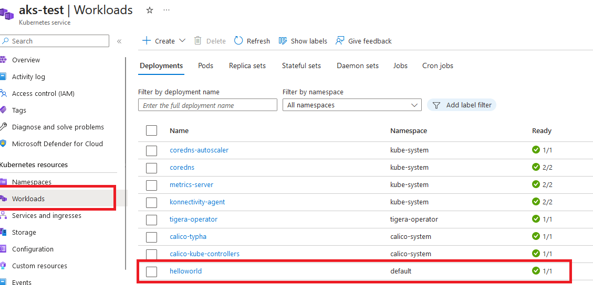

# The AKS Workshop - Lab n°2

Welcome to the Azure Kubernetes Workshop n°2. In this lab, you'll go through tasks that will help you master the basic and more advanced topics required to deploy a containerized application to Kubernetes on [Azure Kubernetes Service (AKS)](https://azure.microsoft.com/en-us/services/kubernetes-service/).

You can use this guide as a Kubernetes tutorial and as study material to help you get started learning Kubernetes.

Some things you'll be going through:

- Build your own application
- Containerize it
- Push it to a registry
- Deploying the app to AKS

You will also cover subjects such as:

- DevSecOps
- Scaling (manual and automatic)
- Implement some security
- some other fun things

Be ready!

## Prerequisites

### Tools

This course is entirely explained from a Linux environment (on Windows, a quick win can be to [go with the Windows Linux Subsystem](https://learn.microsoft.com/en-us/windows/wsl/install)).

You can use [the Azure Cloud Shell service](https://shell.azure.com) once you log in with an Azure subscription. The Azure Cloud Shell has the Azure CLI pre-installed and configured to connect to your Azure subscription, as well as [kubectl](https://github.com/kubernetes/kubectl).

Alternatively, you need to meet the following requirements:

- [Azure CLI](https://github.com/Azure/azure-cli) v2.81.0
- [kubectl](https://github.com/kubernetes/kubectl) v1.32+
- [Kubernetes](https://kubernetes.io) v1.32+ (managed from [Azure Kubernetes Service](https://learn.microsoft.com/en-us/azure/aks))
- a tool to manager a cluster such as [OpenLens](https://github.com/MuhammedKalkan/OpenLens) would greatly help

### Azure subscription

#### If you have an Azure subscription

You may use your subscription or use a provided one by your company.

<details>
<summary>Click to expand</summary>


Please consider using your username and password to login into [the Azure Portal](https://portal.azure.com). Also, please authenticate your Azure CLI by running the command below on your machine and following the instructions.

```sh
az account show
az login

# or by specifying the tenant
az login --tenant ID_TENANT
```


</details>

#### Azure Cloud Shell

You can use the Azure Cloud Shell accessible at <https://shell.azure.com> once you log in with an Azure subscription.

<details>
<summary>Click to expand</summary>


Head over to <https://shell.azure.com> and sign in with your Azure Subscription details.

Select **Bash** as your shell.


Select **Show advanced settings**


Set the **Storage account** and **File share** names to your resource group name (all lowercase, without any special characters), then hit **Create storage**


You should now have access to the Azure Cloud Shell


</details>

#### Tips for uploading and editing files in Azure Cloud Shell

- You can use `code <file you want to edit>` in Azure Cloud Shell to open the built-in text editor. The "Close" icon is on the top right corner and is sometimes not visible.
- You can upload files to the Azure Cloud Shell by dragging and dropping them
- You can also do a `curl -o filename.ext https://file-url/filename.ext` to download a file from the internet. (or use the *git clone* command)

## Container and Kubernetes basics

In this lab, you will be creating and deploying containers.

To ensure a smooth experience, please familiarize yourself beforehand with container basics using [Docker introduction on MS Learn](https://learn.microsoft.com/en-us/dotnet/architecture/microservices/container-docker-introduction/). Alternatively, you can check [Docker's Get started guide](https://docs.docker.com/get-started/).

If you are keen to explore the advanced optional sections, we strongly encourage you to have some prior knowledge of Kubernetes and its concepts. If you are new to Kubernetes, start with the [Kubernetes Learning Path](https://aka.ms/LearnKubernetes) to learn Kubernetes basics, then go through the concepts of [what Kubernetes is and what it isn't](https://aka.ms/k8sLearning).

If you are a more experienced Kubernetes developer or administrator, you may have a look at the [Kubernetes best practices ebook](https://aka.ms/aks/bestpractices).

## Tasks

If you're working through this as part of a team-based exercise, ensure you make progress at a good pace ensuring you understand perfectly what you are doing. It's not a race nor a competition.

<div class="tip" data-title="Hint">

> If you get stuck, you can ask for help from the proctors. You may also choose to peek at the solutions but **the idea of the lab is for you to search a little bit by yourself**.

</div>

### Build

In this first part, you are going to dockerize an application and publish your container image in a registry.

### Deployment

In the next part, you are going to deploy your application in a running cluster.

### Security

You will implement some DevSecOps principles by scanning your files and you will learn how to securely access resources outside of the cluster.

### Autoscaling

You will implement autoscaling and simulate high load on your application.

---

# Build

In this challenge, you will add a Dockerfile to a web application, build it, and run it using a Docker container. You must understand how to build container images before using an orchestrator such as Kubernetes. The build of the image must be done on your computer and Docker must be installed and running.

## Build locally

#### Get the `webapp` source code

Download the `webapp` sample app: [hello-world.zip](https://github.com/lgmorand/training-aks-lab2/blob/main/sample-app/hello-world.zip). If you are using the Cloud Shell you can either download and upload the files, or you can use *[wget](https://doc.ubuntu-fr.org/wget)* and *[unzip](https://doc.ubuntu-fr.org/zip)* commands. 

<details>
<summary>Click to expand</summary>


```sh
wget -O hello-world.zip https://github.com/lgmorand/training-aks-lab2/blob/main/sample-app/hello-world.zip
unzip hello-world.zip
cd hello-world
```


</details>

<div class="tip" data-title="Tip">

>  Once downloaded, it may be useful to look and read some of the files contained in the ZIP.

</div>

#### Build a Docker image

To run the app in Docker, you need to add a [Dockerfile](https://docs.docker.com/build/building/packaging/#dockerfile) describing how the app will be built and run.

Create a new file named `Dockerfile` at the root of the app code and fill it with instructions on how to build and run the app. We could build the app and then containerize the result, but it is also a smart idea to do the build within the container and guarantee the same behavior of the build part too. To do that, you will have to use multi-stage build.

<div class="tip" data-title="Hint">

> Refer to Docker's [language-specific guide](https://docs.docker.com/language/) to write your dockerfile and try to find within the code, the command to build (compile) the app.

</div>

<details>
<summary>Click to expand</summary>


```dockerfile
FROM node:lts

ENV NODE_ENV=production

# Copy app code and install dependencies
WORKDIR /app
COPY ["package.json", "package-lock.json*", "./"]
RUN npm ci
COPY . .

# Start the app
EXPOSE 3000
CMD [ "node", "server.js" ]
```


</details>

Now that you have a Dockerfile, you need to use it to build a Docker image.

Use `docker build` to create the image.

<details>
<summary>Click to expand</summary>


```sh
# Run this command in the root where you created a Dockerfile
docker build -t helloworld .
```


</details>

#### Run the app

Use `docker run` to start a new container from the image you have just created. Use the port 9000 for your test (or any available one).

<details>
<summary>Click to expand</summary>


```sh
# Use the port 9000 to serve the app
docker run -it -p 9000:3000 helloworld
```


</details>

Finally, load the app URL [http://localhost:9000](http://localhost:9000) in a browser and make sure you see a `Hello world` message. As you can see, the container runs a node app, exposes it on port 3000 but thanks to docker, you run it and expose the running container behind the port 9000.

> **Resources**
>
> * <https://docs.docker.com/get-started/02_our_app/>
> * <https://docs.docker.com/language/>
> * <https://docs.docker.com/engine/reference/builder/>

Ok, you know how to containerize an application to test it locally, but let's now do it properly following DevOps principles.

## Create a build pipeline

#### Import your application

In order to move forward, you need to import the source code in your Azure DevOps project. You normally have a dedicated project on [https://dev.azure.com/](https://dev.azure.com/) provided by your trainer/company. This repository will be used for the different parts of this workshop.

Import the downloaded files (hello-world.zip) to your repository. You can either upload them manually or doing it properly with Git (= you have to clone the Azure Repo, paste files and commit them).

<details>
<summary>Click to expand</summary>


</details>

#### Create a build pipeline

Creating a build pipeline in software development offers several advantages, which contribute to more efficient and reliable software development processes. Here are some of the key benefits:

- **Automation**: Build pipelines automate the process of compiling, testing, and deploying code. This reduces the need for manual interventions, leading to faster and more consistent builds.

- **Consistency**: Build pipelines ensure that every code change goes through the same set of steps, which leads to consistent build and deployment processes. This consistency reduces the chances of human error.

- **Reliability**: With automated testing and deployment processes, the reliability of your software increases. This helps catch issues early in the development cycle, reducing the risk of defects reaching production.

- **Scalability**: Build pipelines can be easily scaled to accommodate larger development teams and more complex projects. This allows for the efficient management of various branches, environments, and configurations.

- **Reproducibility**: Build pipelines enable the easy reproduction of any previous build or release. This is vital for troubleshooting and debugging issues because you can easily recreate the exact state of the software at a specific point in time.

- **Continuous Integration (CI)**: Build pipelines are a fundamental part of CI, allowing developers to integrate their code changes into the main repository frequently. This encourages collaboration, early bug detection, and faster development cycles.

- **Faster Feedback**: Automated testing within the pipeline provides quick feedback to developers. This means that if a code change introduces a problem, developers can identify and address it sooner rather than later.

- **Version Control Integration**: Build pipelines often integrate with version control systems like Git, ensuring that only approved changes are built and deployed.

- **Deployment Flexibility**: Depending on the pipeline's configuration, you can deploy software to various environments, such as development, staging, and production. This flexibility is crucial for testing and minimizing the impact of changes on end-users.

- **Security**: By including security checks in the build pipeline, you can catch vulnerabilities and security issues early in the development process, reducing the risk of deploying insecure software.

- **Cost-Efficiency**: Automation reduces the time and effort required for each build and deployment, ultimately lowering operational costs and freeing up resources for other tasks.

- **Monitoring and Metrics**: Build pipelines often provide insights and metrics about the success and performance of each build and deployment, allowing teams to make data-driven decisions for improvement.

- **Documentation**: A well-structured build pipeline serves as documentation for the software's build and deployment processes. This is especially useful for onboarding new team members and maintaining institutional knowledge.

- **Continuous Delivery (CD)**: When combined with a CD pipeline, the build pipeline enables a continuous, automated delivery process, allowing for rapid and reliable software releases.

In summary, build pipelines are essential in modern software development as they contribute to faster, more reliable, and efficient development processes. They promote automation, consistency, and collaboration while reducing the risk of errors and improving the overall quality of the software being developed.

You are now asked to create a build pipeline based on the source code you just downloaded. **The pipeline must be able to build a docker image**.

For this exercise, you are allowed to create a classic pipeline (WYSIWYG) or a yaml pipeline (pipeline as code), as long as it works. 

<details>
<summary>Click to expand</summary>


Since we do the build inside the docker file, we only need one step, to build the docker image. You can use Docker or buildkit

**Using Docker build**

``` yaml
trigger:
- main

resources:
- repo: self

variables:
  tag: '$(Build.BuildId)'

stages:
- stage: Build
  displayName: Build image
  jobs:
  - job: Build
    displayName: Build
    pool:
      vmImage: 'ubuntu-latest'
    steps:
    - task: Docker@2
      displayName: Build an image
      inputs:
        command: build
        dockerfile: '$(Build.SourcesDirectory)/dockerfile'
        tags: |
          helloworld-$(tag)
```

**Using Buildkit**

```yaml
trigger:
- main

resources:
- repo: self

variables:
  tag: '$(Build.BuildId)'

stages:
- stage: Build
  displayName: Build image
  jobs:
  - job: Build
    displayName: Build
    pool:
      vmImage: 'ubuntu-latest'
    steps:
    - bash: |
        buildctl --addr tcp://buildkitd:1234 build \
        --frontend dockerfile.v0 \
        --local context=. \
        --local dockerfile=. \
        --opt build-arg:http_proxy="$(PROXY)" \
        --opt build-arg:https_proxy="$(PROXY)" \
        --opt build-arg:HTTP_PROXY="$(PROXY)" \
        --opt build-arg:HTTPS_PROXY="$(PROXY)" \
        --output type=docker,name=$(REGISTRY)/aks-training/studentXXX/helloworld-$(Build.SourceBranchName):$(Build.BuildId) | podman load
      displayName: Building image

```


</details>

## Push to a registry

#### Publish your container image

To deploy a docker image, you first need to publish it to a container registry. On Azure, the solution is Azure Container Registry but you may also decide to use an alternative such as [Harbor](https://goharbor.io) or [Artifactory](https://jfrog.com/fr/artifactory/) if your company uses them.

Add steps to your pipeline to push your images to your registry.

<details>
<summary>Click to expand</summary>


With the **Azure DevOps Docker** task

```yaml
- task: Docker@2
      displayName: Build an image
      inputs:
        containerRegistry: 'ACR' #  you need to create a docker service connection
        repository: 'studentXXX' # your student name
        command: 'buildAndPush' # build AND push
        Dockerfile: $(Build.SourcesDirectory)/dockerfile
        tags: 'helloworld-$(tag)'
```

To create the service connection, go to your Azure DevOps project settings and add a **Docker Registry** service connection. Normally we would use an Azure Container Registry with a service principal, but for simplification, we are going to connect using Docker credentials (provided by your trainer)


With **Docker**

``` bash
docker login <url-registry>

docker tag <image-name>[:TAG] <container-registry-IP>/<project-name>/<image-name>[:TAG]

docker push <container-registry-IP>/<namespace-name>/<image_name>
```

With **Podman**

``` bash
podman push --creds='$(REGISTRY_CREDS)' $(REGISTRY)/aks-training/studentXXX-$(BUILD_ID)
```


</details>

<div class="warning" data-title="Warning">

> never forget that using latest tag is [most of the time a very bad practice](https://vsupalov.com/docker-latest-tag/). It's not mandatory in the lab but you should find a way to use an incremental tag number.

</div>

---

# Deployment

It's now time to deploy your application in your kubernetes cluster.

## Deploy your application

### Create a manifest

You need a deployment manifest file to deploy your application. The manifest file allows you to define what type of resource you want to deploy and all the details associated with the workload.

Kubernetes groups containers into logical structures called pods, which have no intelligence. Deployments add the missing intelligence to create your application.

Create a deployment file named **deployment.yaml** which matches the following requirements:

- deploy your application with only one replica
- set the environment variable GREETEE to AKS
- set requests with CPU = 100m and Memory = 128Mi


<details>
<summary>Click to expand</summary>


Create a **deployment.yaml** file with the following contents, and make sure to replace **<registry-fqdn>** with the fully qualified name of your registry:

```yaml
# deployment.yaml
apiVersion: apps/v1
kind: Deployment
metadata:
  name: helloworld
spec:
  selector: # Define the wrapping strategy
    matchLabels: # Match all pods with the defined labels
      app: helloworld # Labels follow the `name: value` template
  template: # This is the template of the pod inside the deployment
    metadata:
      labels:
        app: helloworld
    spec:
      nodeSelector:
        kubernetes.io/os: linux
      containers:
        - image: <registry-fqdn>/helloworld:tag # Registry + image name
          name: helloworld
          resources:
            requests:
              cpu: 100m
              memory: 128Mi
          ports:
            - containerPort: 3000
              name: http
          env:
            - name: GREETEE
              value: AKS
```


</details>

<div class="warning" data-title="Warning">

> Your container registry (**if not an Azure Container Registry**) may require explicit credentials to access it (see this [documentation](https://kubernetes.io/docs/tasks/configure-pod-container/pull-image-private-registry/#create-a-secret-by-providing-credentials-on-the-command-line) and this one [documentation](https://kubernetes.io/docs/tasks/configure-pod-container/pull-image-private-registry/#create-a-pod-that-uses-your-secret)).

</div>

<details>
<summary>Click to expand</summary>


Open a shell connected to your cluster and run the command. Don't forget to put quotes around username and password. Sometimes, depending on your shell, some chars may be removed without the quotes

```bash
kubectl create secret docker-registry registry-pull `
                      --docker-server=yourregistry.fqdn `
                      --docker-username='<user>' `
                      --docker-password='<password>' `
                      -n your-namespace
```

If you are not using an Azure Container Registry, you may have to add credentials to connect to the cluster such as:

```yaml
    spec:
      nodeSelector:
        kubernetes.io/os: linux
      containers:
        - image: <registry-fqdn>/helloworld:tag # Registry + image name
          name: helloworld
          resources:
            requests:
              cpu: 100m
              memory: 128Mi
          ports:
            - containerPort: 3000
              name: http
          env:
            - name: GREETEE
              value: AKS
       imagePullSecrets: # credentials to connect to your registry. ONLY required if not using an attached Azure Container Registry
       - name: registry-pull
```


</details>

### Connect to your cluster

To deploy an application within a cluster, you need to authenticate as a user who has enough rights (*[userRole](https://kubernetes.io/docs/reference/access-authn-authz/rbac/)*) to create your objects (pods, services, etc.).

To connect to a kubernetes cluster, you must use a kubeconfig file which contains the URL and the credentials to connect to a cluster. This kubeconfig will be provided by your trainer

Once you retrieved your kubeconfig file, you must use it in the pipeline in order to be able to connect to the cluster.

You can reuse it in your pipeline in different ways, some are better than others. Think and choose wisely:

- you could add the kubeconfig in the git repository and use the --file parameter from kubectl command
- you could inject the kubeconfig in a global variable and use it to recreate a kubeconfig during pipeline execution
- you could create a [service connection](https://colinsalmcorner.com/azure-pipelines-for-private-aks-clusters/#create-a-generic-k8s-endpoint) which allow to securely connect to a resource (preferred solution)

<details>
<summary>Click to expand</summary>


The cleanest way is to create a service connection which will be injected in your pipeline.

> Note: the simplest way to get your kubeconfig file is to use the az aks get-credentials command and reuse the generated kubeconfig file

```cli
    # login to azure
    az login
    
    # login to the AKS cluster
    az aks get-credentials -n <cluster_name> -g <cluster_resource_group_name>
```

To create a Service Connection, in the settings of your Azure DevOps project and click on "Service connections"


From there, create a kubernetes service connection based on kubeconfig.


<div class="warning" data-title="Warning">

> If you have an error with Token validation something, it means that your account does not have enough rights to create a service connection.

</div>

</details>

### Add deployment steps in your pipeline

Add steps to your pipeline to use the kubectl command in addition of your kubeconfig file. If you created a service connection, you can use the **KubernetesManifest** task.

<details>
<summary>Click to expand</summary>


```yaml
pool: <name-of-your-agent-pool>

steps:
- script: ls
- task: KubernetesManifest@1
  inputs:
    action: 'deploy'
    connectionType: 'kubernetesServiceConnection'
    kubernetesServiceConnection: 'name-of-service-connection'
    namespace: 'studentXXX'
    manifests: './deployment.yaml'
```


</details>

When it's done. Run your deployment pipeline.

### Check your deployed application

Connect to your cluster and ensure the deployment is successful. Once done, get the name of the pod. Do it using the Azure Web portal but also using a command line (your computer or the Cloud Shell)

<details>
<summary>Click to expand</summary>


Using the Web portal



Using a shell

```sh
kubectl get deploy helloworld
```

You should see an output similar to:

```sh
NAME              READY   UP-TO-DATE   AVAILABLE   AGE
helloworld            1/1     1            1           16s
```

Use `kubectl get pods` to check if the pod is running. Obtain the name of the created pod.

```sh
kubectl get pods
```

You should see an output similar to:

```sh
NAME                               READY   STATUS    RESTARTS   AGE
helloworld-7c58c5f699-r79mv            1/1     Running   0          63s
```


</details>

Easy isn't it ?

## Scale your application

### Scaling

You deployed your application but you anticipate a high load of your application. The first solution is to manually scale out your application by increasing the number of instances of your application.

Connect to your cluster and increase the number of pods using the command line. Try to have 5 working pods and try to find how by reading the [documentation](https://kubernetes.io/docs/concepts/workloads/controllers/deployment/).

<details>
<summary>Click to expand</summary>


```sh
kubectl scale deployment/helloworld --replicas=5
```


</details>

It worked but is it a good practice to change the number of replicas directly in the cluster? The answer is "no" because on the next run of your deployment pipeline, the number of replicas will come back to the original value. It is called "configuration drift" because your source of truth (the repository) is not equal to your production environment.

Edit your manifest accordingly and specify the number of replicas there. Run again your deployment pipeline.

#### Control the deployment

Your pipeline went fine but how do you ensure that your replicas are here ?

Connect to your cluster and list your deployment to check that you have **10** running containers.

<details>
<summary>Click to expand</summary>


```sh
kubectl get pods
```


</details>

Now, list your pods. How are your pods replicated across the nodes? List the pods in a way to see the nodes

<details>
<summary>Click to expand</summary>


```sh
kubectl get pods -o wide
```

You should see something like this and you can see that pods are deployed on the different nodes of your cluster.

```sh
NAME                          READY   STATUS    RESTARTS   AGE   IP            NODE                                NOMINATED NODE   READINESS GATES
helloworld-75d9b9d44c-7f7rh   1/1     Running   0          40s   10.244.0.10   aks-agentpool-14914408-vmss000000   <none>           <none>
helloworld-75d9b9d44c-ctdrv   1/1     Running   0          40s   10.244.0.11   aks-agentpool-14914408-vmss000000   <none>           <none>
helloworld-75d9b9d44c-kqmdv   1/1     Running   0          40s   10.244.1.9    aks-agentpool-14914408-vmss000001   <none>           <none>
helloworld-75d9b9d44c-kw47c   1/1     Running   0          40s   10.244.1.8    aks-agentpool-14914408-vmss000001   <none>           <none>
helloworld-75d9b9d44c-qjkg2   1/1     Running   0          77m   10.244.1.7    aks-agentpool-14914408-vmss000001   <none>           <none>
```


</details>

## Get some logs

Everything went fine but that's not always the case.

### Retrieve logs

The application is logging some information.

<details>
<summary>Click to expand</summary>


A well-developed application could potentially push logs directly to a repository (e.g., Application Insights) but there are numerous cases where the logs are simple console logs created by the app. You can retrieve them by running the `kubectl logs` command:

```sh
kubectl logs helloworld-75d9b9d44c-qjkg2
```

You should be able to see the logs of the application:

```sh
azure [ ~ ]$ kubectl logs helloworld-5d9bdb967d-8jmhh
Web app listening on port 80
error! not enough icecream
My little secret: I love icecream
```


</details>

### Look inside

Not necessarily a good practice but sometimes you need to dig a little bit. The application is creating a file in the cluster. Try to retrieve the content of the file without looking at the source code. The documentation may [help](https://kubernetes.io/docs/tasks/debug/debug-application/get-shell-running-container/).

> Hint: the file is named **log.txt**

<details>
<summary>Click to expand</summary>


The solution is to connect directly to the container, more exactly to connect inside the container and look for the file. It can be done with the `kubectl exec` command.

```sh
kubectl exec --stdin --tty helloworld-5d9bdb967d-8jmhh -- /bin/bash
```

Once connected, you can list the files and then display the content of the good one:

```sh
azure [ ~ ]$ kubectl exec --stdin --tty helloworld-5d9bdb967d-8jmhh -- /bin/bash

root@helloworld-5d9bdb967d-8jmhh:/app# ls
README.md  deployment.yaml  dockerfile  log.txt  node_modules nodejs package-lock.json  package.json  server.js

root@helloworld-5d9bdb967d-8jmhh:/app# cat log.txt
42 is the answer

root@helloworld-5d9bdb967d-8jmhh:/app# 
```


</details>

### Debug a non starting deployment

These two previous solutions are fine when a pod starts correctly but what can you do when your pod doesn't even start ?

Edit your deployment.yaml manifest and update the version of the container image. Put a number which does not exist and rerun your pipeline.

Connect to your cluster and watch the status of your deployment. Is something sketchy?
Try to get more information about the (generic) error and then, get more details about the starting steps of the pods.

<details>
<summary>Click to expand</summary>


```sh
kubectl get deploy helloworld
```

Which should show that one pod should be running but 0 are actually working

```sh
azure [ ~ ]$ kubectl get deploy helloworld
NAME         READY   UP-TO-DATE   AVAILABLE   AGE
helloworld   0/1     1            0           2m31s
```

You could run the `kubectl describe` command on the deployment but you would not get enough information. Then since the pod is not running, you should start from the pod.

```sh
kubectl describe pod helloworld-5d9bdb967d-8jmhh
```

Among the different information from the describe command, you should look at events part:

```sh
Events:
  Type     Reason     Age                    From               Message
  ----     ------     ----                   ----               -------
  Normal   Scheduled  3m50s                  default-scheduler  Successfully assigned default/helloworld-646b549b59-l4ntr to aks-agentpool-14914408-vmss000001
  Warning  Failed     2m27s (x6 over 3m50s)  kubelet            Error: ImagePullBackOff
  Normal   Pulling    2m16s (x4 over 3m50s)  kubelet            Pulling image "acrtestengie.azurecr.io/helloworld:fakeversion"
  Warning  Failed     2m16s (x4 over 3m50s)  kubelet            Failed to pull image "acrtestengie.azurecr.io/helloworld:fakeversion": rpc error: code = NotFound desc = failed to pull and unpack image "acrtestengie.azurecr.io/helloworld:fakeversion": failed to resolve reference "acrtestengie.azurecr.io/helloworld:fakeversion": acrtestengie.azurecr.io/helloworld:fakeversion: not found
  Warning  Failed     2m16s (x4 over 3m50s)  kubelet            Error: ErrImagePull
  Normal   BackOff    2m2s (x7 over 3m50s)   kubelet            Back-off pulling image "acrtestengie.azurecr.io/helloworld:fakeversion"
```

As you can see, there is clearly an event when the image cannot be downloaded because it can't resolve it. It could be a version mismatch, an authentication issue or even a network issue but here, the message is clear that the version is the faulty part.


</details>

It's not exhaustive but you learned the basics to debug when something goes wrong with your containers.

---

# Security

Security is critical when developing an application and must be part of the application lifecycle. At Microsoft, we call it [SDL](https://www.microsoft.com/en-us/securityengineering/sdl) for Security Development Lifecycle, a methodology to implement security at every step of an application's life.

In this new chapter, you are going to implement some security concepts regarding containerized applications.

## Scanning your files

### DevSecOps

DevSecOps, short for Development, Security, and Operations, is an approach to software development that integrates security practices into the software development and deployment process. It is important in modern software development for several key reasons:

- **Early Detection and Mitigation of Security Vulnerabilities**: DevSecOps focuses on identifying and addressing security issues at an early stage of development. This reduces the likelihood of security vulnerabilities making their way into the final product, saving time and resources that would otherwise be spent on fixing security flaws post-deployment.

- **Faster Response to Security Threats**: In a DevSecOps environment, security practices are automated and integrated into the development pipeline. This enables rapid response to security threats and the ability to push out security updates quickly. This is critical in a world where cyber threats are constantly evolving.

- **Compliance and Regulatory Requirements**: Many industries are subject to strict regulatory requirements related to data privacy and security (e.g., GDPR, HIPAA). DevSecOps helps organizations ensure compliance by embedding security measures into the development process, making it easier to meet these obligations.

- **Risk Reduction**: By integrating security practices from the outset, DevSecOps reduces the overall risk of security breaches and data loss. This helps organizations protect their reputation, customer trust, and financial assets.

- **Cost-Efficiency**: Fixing security vulnerabilities post-deployment can be expensive and time-consuming. DevSecOps reduces these costs by identifying and addressing security issues early in the development process.

- **Continuous Improvement**: DevSecOps encourages a culture of continuous improvement. Security measures and best practices are regularly reviewed and updated to adapt to the changing threat landscape.

- **Automation**: Automation is a key component of DevSecOps. Automated security testing, continuous monitoring, and threat detection tools help identify and address security issues more efficiently and consistently.

That's why you are going to improve the security of your application !

When you want to secure a containerize application you need to scan/test different components:

- your code, the one your wrote yourself
- the dependencies of your code (package nuget, maven, npm, etc)
- the dockerfile
- your manifest

Each of them require different tools. To analyse your code, you need a SAST (Static Analysis Security Testing) and for the dependencies, you need a SCA (Static Composition Analysis). You are going to focus on your dockerfile and kubernetes manifest. Your goal is to include steps in your build pipeline to scan them and not to push the image if issues are found

You can use any tool of your choice, such as [hadolint](https://kristhecodingunicorn.com/post/k8s_hadolint/) or [other tools](https://github.com/lgmorand/k8s-devSecOps) (we recommend kubeval and checkov) but you need to implement them in your pipeline. You must lint your files (dockerfile and manifest) but also check for vulnerabilities.

> Note: you may have to use more than one tool; Keep in mind that for this lab you may have errors in your files and you can ignore them. You must NOT fix all issues, it is just a practice for you for the lab

<details>
<summary>Click to expand</summary>


Since we do the build inside the docker file, we only need one step, one to build the docker image

``` yaml
trigger:
- main

pool:
  vmImage: ubuntu-latest

steps:

- script: |
    echo 'Downloading Hadolint to lint Dockerfile...'
    wget https://github.com/hadolint/hadolint/releases/download/v2.12.0/hadolint-Linux-x86_64
    chmod +x hadolint-Linux-x86_64
    mv hadolint-Linux-x86_64 hadolint

    echo 'Start Dockerfile lint...'
    ./hadolint dockerfile -f tty > results.txt

    cat results.txt
  displayName: hadolint

- script: |
    echo 'Downloading kubeval'
    wget https://github.com/instrumenta/kubeval/releases/latest/download/kubeval-linux-amd64.tar.gz
    tar xf kubeval-linux-amd64.tar.gz
    sudo cp kubeval /usr/local/bin

    echo 'Scanning your manifest'
    kubeval --schema-location https://raw.githubusercontent.com/garethr/kubernetes-json-schema/master mymanifest.yaml
  displayName: kubeval

- script: |
    echo 'Installing checkov'
    pip3 install checkov

    echo 'Scanning your manifest'
    checkov --file mymanifest.yaml
  displayName: checkov
```


</details>

Ideally you should also add a tool to scan for vulnerabilities in your docker base image. If your files did not trigger any error/warning, you can [import the following files](https://github.com/lgmorand/training-aks-lab2/blob/main/sample-app/devsecops.zip) in your repo and do a quick test.

> Important: you don't need to fix all errors to continue the workshop. The idea is just for you to take the habit of scanning your files.

## Secrets

You will be deploying the Azure Voting App to Azure Kubernetes Service (AKS). This is a simple web app that lets you vote for things and displays the vote totals. You may recognize this app from Microsoft Docs which allows you to vote for "Dogs" or "Cats".

The repo can be found here: [Azure-Samples/azure-voting-app-redis](https://github.com/Azure-Samples/azure-voting-app-redis).

The web application is written in python (front) and this web app uses Redis as the backend database (back). The web app will use credentials to connect to Redis backend.

#### Securing credentials using "Secrets"

In order to deploy the web app and redis in AKS, we need the redis password to be able to connect to redis. You could add it to the YAML file, but that would mean that it would be stored in plain text. So anyone who has access to the YAML file would be able to see the password. Instead, you are going first to use a Kubernetes secret to store the credentials in the cluster.

**Task Hints**

* It's recommended to use kubectl and the `kubectl create secret generic` command to create redis password. Refer to the docs linked in the Resources section, or run `kubectl create secret generic -h` for details

Create secret

<details>
<summary>Click to expand</summary>


```sh
kubectl create secret generic azure-voting-redis-secret --from-literal=password=<your_password> -n <your_namespace>
```

Replace azure-voting-redis-secret, your_password by the secret name and redis password of your choice and your_namespace by the namespace where you need to deploy the secret.
You should see an output similar to:

```sh
secret/azure-voting-redis-secret created
```


</details>

##### Deploy the web app and redis backend

In this section, you will deploy the front web app and the redis backend. Redis password was stored in an AKS secret.

**Task Hints**

* You will use an image from bitnami for Redis backend (mcr.microsoft.com/oss/bitnami), tag 6.0.8.
* You will have to add an env variable named REDIS_PASSWORD that will find the password in AKS secret created before.
* You will use an image from azuredocs for the web app (lgmorand/azure-vote-front), tag v1.
* You will have to add 2 env variables. The first, named REDIS_PWD that will find the password in AKS secret created before and the second named REDIS which is the name of your redis backend container.
* Create services to expose your pod. The backend will not be called outside of the cluster. The frontend will be called outside of the cluster but only with an internal IP, refer to [Internal Load Balancer](https://learn.microsoft.com/en-us/azure/aks/internal-lb?tabs=set-service-annotations#create-an-internal-load-balancer)

<details>
<summary>Click to expand</summary>


Create your yaml file deployment.yaml.

```yaml
apiVersion: apps/v1
kind: Deployment
metadata:
  name: azure-vote-back
spec:
  replicas: 1
  selector:
    matchLabels:
      app: azure-vote-back
  template:
    metadata:
      labels:
        app: azure-vote-back
    spec:
      nodeSelector:
        "kubernetes.io/os": linux
      containers:
      - name: azure-vote-back
        image: mcr.microsoft.com/oss/bitnami/redis:6.0.8
        env:
        - name: REDIS_PASSWORD
          valueFrom:
            secretKeyRef:
              name: azure-voting-redis-secret
              key: password          
        ports:
        - containerPort: 6379
          name: redis
---
apiVersion: v1
kind: Service
metadata:
  name: azure-vote-back
spec:
  ports:
  - port: 6379
  selector:
    app: azure-vote-back
---
apiVersion: apps/v1
kind: Deployment
metadata:
  name: azure-vote-front
spec:
  replicas: 1
  selector:
    matchLabels:
      app: azure-vote-front
  strategy:
    rollingUpdate:
      maxSurge: 1
      maxUnavailable: 1
  minReadySeconds: 5 
  template:
    metadata:
      labels:
        app: azure-vote-front
    spec:
      nodeSelector:
        "kubernetes.io/os": linux
      containers:
      - name: azure-vote-front
        image: lgmorand/azure-vote-front:v1
        ports:
        - containerPort: 80
        resources:
          requests:
            cpu: 250m
          limits:
            cpu: 500m
        env:
        - name: REDIS
          value: "azure-vote-back"
        - name: REDIS_PWD
          valueFrom:
            secretKeyRef:
              name: azure-voting-redis-secret
              key: password          
---
apiVersion: v1
kind: Service
metadata:
  name: azure-vote-front
  annotations:
    service.beta.kubernetes.io/azure-load-balancer-internal: "true"  
spec:
  type: LoadBalancer
  ports:
  - port: 80
  selector:
    app: azure-vote-front
```

Apply the deployment:

```sh
kubectl apply -f ./deployment.yaml -n <your_namespace>
```

You should see an output similar to:

```sh
deployment.apps/azure-vote-back created
service/azure-vote-back created
deployment.apps/azure-vote-front created
service/azure-vote-front created
```


</details>

##### Check that the application is working fine

You will first check front logs to be sure that there is no error connecting to redis backend and then check the application.

<details>
<summary>Click to expand</summary>


In order to watch logs, find the pod name with the command:

```sh
kubectl get pods -n <your_namespace>
```

You should see an output similar to:

```sh
NAME                                READY   STATUS    RESTARTS   AGE
azure-vote-back-68f656645-pdvxw     1/1     Running   0          17m
azure-vote-front-7df999d7c9-9xvqq   1/1     Running   0          17m
```

Check logs with pod name, it should be azure-vote-front-xxx.
If the password is incorrect, you should see in logs something like: redis.exceptions.ResponseError: WRONGPASS invalid username-password pair.

```sh
kubectl logs <pod_name> -n <your_namespace>
```

Get the service IP to test the app in your browser:

```sh
kubectl get svc -n <your_namespace>
```

 You should see an output similar to:

```sh
NAME               TYPE           CLUSTER-IP     EXTERNAL-IP   PORT(S)        AGE
azure-vote-back    ClusterIP      10.0.194.219   <none>        6379/TCP       30s
azure-vote-front   LoadBalancer   10.0.74.34     10.2.0.24   80:31365/TCP   30s
```

Test your app: [http://EXTERNAL-IP-FRONT](http://EXTERNAL-IP-FRONT) If the application is not exposed on Internet (check why), you have to do a CURL command from a container (kubectl exec)


</details>

#### Securely storing secrets

Kubernetes secrets are just base64 encoded strings. Anyone with access to the cluster can decode them and see the actual value. Run the following command to decode the password secret:

```sh
kubectl get secrets azure-voting-redis-secret -o jsonpath='{.data.password}' -n <your-namespace> | base64 --decode
```

There are a few ways to store secrets in a more secure manner. One recommended way is to use Azure Key Vault.
So you are going to replace the kubernetes secret with a secret stored in Azure Key Vault and redeploy the application.

##### Delete Kubernetes secret

You will first delete the kubernetes secret created before.

**Task Hints**

* It's recommended to use kubectl and the `kubectl delete secret` command to delete a secret. Refer to the docs linked in the Resources section, or run `kubectl delete secret -h` for details

<details>
<summary>Click to expand</summary>


```sh
kubectl delete secret azure-voting-redis-secret -n <your_namespace>
```

Replace azure-voting-redis-secret and your_namespace by your secret's name and your_namespace by the namespace where you created the secret.
You should see an output similar to:

```sh
secret "azure-voting-redis-secret" deleted
```


</details>

##### Authentication to Azure Key Vault using workload identity

The authentication to the Azure Key Vault will be implemented using workload identity. This will allow the pod to use an Azure user-assigned managed identity to authenticate to the Azure Key Vault. A keyvault has already been provisioned by the teacher. It contains one secret named "redis-password", the one you want to inject into your pods. One way of doing it is to store a secret to access the keyvault (to retrieve this secret) but it would only move the problem: there is a secret in kubernetes. 
A good alternative with AKS is to use Workload identity where you can connect safely to an Azure Service without any password or connection string. Magic! (almost)

A Microsoft Entra Workload ID is an identity that an application running on a pod uses to authenticate itself against other Azure services that support it, such as Storage or SQL or Key Vault. It integrates with the native Kubernetes capabilities to federate with external identity providers. In this security model, the AKS cluster acts as a token issuer. Microsoft Entra ID then uses OpenID Connect (OIDC) to discover public signing keys and verify the authenticity of the service account token before exchanging it for a Microsoft Entra token.

To do this, you need:

* a user-assigned managed identity, this managed identity must have read access to Azure Key Vault secrets to be able to read redis-password (already created by the teacher)
* a kubernetes service account (you'll have to create it)
* a federated identity credential between the managed identity, service account issuer, and subject (federation already prepared by the teacher)

> Note: normally you should do all steps but since you don't have access to this subscription, we did it for you

<details>
<summary>Click to expand</summary>


Here is the full procedure, just make the relevant steps.

Create a managed identity using the az identity create command (no need to do it)

```sh
az identity create --name <user_assigned_identity_name> --resource-group <rg> --location <region>
```

Set an access policy for the managed identity to access the Key Vault secret using the following commands. (already done)

```sh
export USER_ASSIGNED_CLIENT_ID="$(az identity show --resource-group <rg> --name <user_assigned_identity_name> --query 'clientId' -otsv)"
echo $USER_ASSIGNED_CLIENT_ID
az keyvault set-policy --name <akv_name> --secret-permissions get --spn "${USER_ASSIGNED_CLIENT_ID}"
```

Create the service account. (yeah, create it! :D)

```yaml
apiVersion: v1
kind: ServiceAccount
metadata:
  annotations:
    azure.workload.identity/client-id: <user-assigned-client-id>
  name: <service-account-name>
  namespace: <your_namespace>
```

Apply the deployment:

```sh
kubectl apply -f ./serviceaccount.yaml -n <your_namespace>
```

You should see an output similar to:

```sh
serviceaccount/votingsa created
```

Get the AKS cluster OIDC Issuer URL using the az aks show command.

```sh
export AKS_OIDC_ISSUER="$(az aks show --resource-group <rg> --name <aks_cluster_name> --query "oidcIssuerProfile.issuerUrl" -o tsv)"
echo $AKS_OIDC_ISSUER
```

Create the federated identity credential between the managed identity, service account issuer, and subject using the az identity federated-credential create command. (already done by your teacher)

```sh
az identity federated-credential create \
    --name <federated_identity_name> \
    --identity-name <user_assigned_identity_name> \
    --resource-group <rg> \
    --issuer ${AKS_OIDC_ISSUER} \
    --subject system:serviceaccount:<service_account_namespace>:<service_account_name>
```


</details>

##### Secret Store CSI driver

Before creating the secret provider class, you need the tenant id, you can use the following command to find it:

```sh
az identity show \
  --resource-group <rg> \
  --name <user_assigned_identity_name> \
  --query tenantId -o tsv
```

Create a secret provider class and apply the saved yaml file. Refer to [CSI Secret Store Driver](https://learn.microsoft.com/en-us/azure/aks/csi-secrets-store-driver)

<details>
<summary>Click to expand</summary>


```yaml
# This is a SecretProviderClass example using workload identity to access your key vault
apiVersion: secrets-store.csi.x-k8s.io/v1
kind: SecretProviderClass
metadata:
  name: azure-kv-wi # needs to be unique per namespace
spec:
  provider: azure
  parameters:
    usePodIdentity: "false"       
    clientID: "<USER_ASSIGNED_CLIENT_ID>" # Setting this to use workload identity
    keyvaultName: <akv_name>       # Set to the name of your key vault
    cloudName: ""                         # [OPTIONAL for Azure] if not provided, the Azure environment defaults to AzurePublicCloud
    objects:  |
      array:
        - |
          objectName: redis-password
          objectType: secret              # object types: secret, key, or cert
    tenantId: "<tenant_id>"        # The tenant ID of the key vault
```


</details>

##### Update the deployment

Update the deployment to get redis secret in key vault using workload identity instead of kubernetes secret. Refer to [CSI Secret Store Driver](https://learn.microsoft.com/en-us/azure/aks/csi-secrets-store-driver).

<details>
<summary>Click to expand</summary>


```yaml
apiVersion: apps/v1
kind: Deployment
metadata:
  name: azure-vote-back
spec:
  replicas: 1
  selector:
    matchLabels:
      app: azure-vote-back
  template:
    metadata:
      labels:
        app: azure-vote-back
    spec:
      nodeSelector:
        "kubernetes.io/os": linux
      containers:
      - name: azure-vote-back
        image: mcr.microsoft.com/oss/bitnami/redis:6.0.8
        ports:
        - containerPort: 6379
          name: redis
        volumeMounts:
        - name: secrets-store
          mountPath: "/mnt/secrets-store"
          readOnly: true
        env:
        - name: REDIS_PASSWORD
          value: /mnt/secrets-store/redis-password
      serviceAccountName: <service-account-name>
      volumes:
        - name: secrets-store
          csi:
            driver: secrets-store.csi.k8s.io
            readOnly: true
            volumeAttributes:
              secretProviderClass: azure-kv-wi              
---
apiVersion: v1
kind: Service
metadata:
  name: azure-vote-back
spec:
  ports:
  - port: 6379
  selector:
    app: azure-vote-back
---
apiVersion: apps/v1
kind: Deployment
metadata:
  name: azure-vote-front
spec:
  replicas: 1
  selector:
    matchLabels:
      app: azure-vote-front
  strategy:
    rollingUpdate:
      maxSurge: 1
      maxUnavailable: 1
  minReadySeconds: 5 
  template:
    metadata:
      labels:
        app: azure-vote-front
    spec:
      nodeSelector:
        "kubernetes.io/os": linux
      containers:
      - name: azure-vote-front
        image: lgmorand/azure-vote-front:v1
        ports:
        - containerPort: 80
        resources:
          requests:
            cpu: 250m
          limits:
            cpu: 500m
        volumeMounts:
        - name: secrets-store
          mountPath: "/mnt/secrets-store"
          readOnly: true
        env:
        - name: REDIS
          value: "azure-vote-back"
        - name: REDIS_PWD
          value: /mnt/secrets-store/redis-password
      serviceAccountName: <service-account-name>
      volumes:
        - name: secrets-store
          csi:
            driver: secrets-store.csi.k8s.io
            readOnly: true
            volumeAttributes:
              secretProviderClass: azure-kv-wi         
---
apiVersion: v1
kind: Service
metadata:
  name: azure-vote-front
  annotations:
    service.beta.kubernetes.io/azure-load-balancer-internal: "true"  
spec:
  type: LoadBalancer
  ports:
  - port: 80
  selector:
    app: azure-vote-front
```


</details>

Test if your application works fine.

##### How to use workload identity in your code?

Microsoft Entra Workload ID works especially well with the Azure Identity client libraries and the Microsoft Authentication Library (MSAL) collection if you're using application registration. Your workload can use any of these libraries to seamlessly authenticate and access Azure cloud resources.

You can find more information in [Microsoft documentation](https://learn.microsoft.com/en-us/azure/aks/workload-identity-overview?tabs=dotnet).
* [Azure Identity Client libraries samples](https://learn.microsoft.com/en-us/azure/aks/workload-identity-overview?tabs=dotnet#azure-identity-client-libraries)
* [MSAL samples](https://learn.microsoft.com/en-us/azure/aks/workload-identity-overview?tabs=dotnet#microsoft-authentication-library-msal)
* [MSAL sample in .net with Azure Key Vault](https://github.com/Azure/azure-workload-identity/tree/main/examples/msal-net/akvdotnet)
* [Tutorial - Use a workload identity with an application on Azure Kubernetes Service (AKS)](https://learn.microsoft.com/en-us/azure/aks/learn/tutorial-kubernetes-workload-identity)

> **Resources**
>
> * <https://kubernetes.io/docs/concepts/configuration/secret/>
> * <https://learn.microsoft.com/en-us/cli/azure/keyvault?view=azure-cli-latest#az-keyvault-create>
> * <https://learn.microsoft.com/en-us/cli/azure/keyvault/secret?view=azure-cli-latest>
> * <https://learn.microsoft.com/en-us/azure/aks/workload-identity-deploy-cluster>
> * <https://learn.microsoft.com/en-us/azure/aks/csi-secrets-store-driver>
> * <https://learn.microsoft.com/en-us/azure/aks/internal-lb?tabs=set-service-annotations#create-an-internal-load-balancer>

---

# Storage

Some containerized applications may require storing files on the disk. They could use temporary storage (but it would disappear on next pod "restart") or they could require retaining the data. In such a use case, you have three choices:

- write on a network share
- write using SDK but it implies to modify your code (i.e. SDK to write a blobstorage)
- write on a local mount which points to a storage system

You are going to use the last one in order to cover the case where the application code cannot be modified or when you want to remain agnostic from the Cloud provider.

You are going to use two concepts:

- The [PVC (PersistentVolumeClaim)](https://kubernetes.io/docs/concepts/storage/persistent-volumes/#persistentvolumeclaims): which defines the requirements of your application
- The [StorageClass](https://kubernetes.io/docs/concepts/storage/storage-classes/): which defines the underlying storage technology

List the available **StorageClass** in your cluster with the `kubectl` command. Try to keep in mind the name of the storage class related to Azure Files.

<details>
<summary>Click to expand</summary>


Simply list the StorageClass objects

```bash
kubectl get storageclass
```

You should obtain something like this. It depends on the storageclass present by default in your cluster, either added by the Cloud provider or by the administrator. You can of course add additional classes.

```bash
[ ~ ]$ kubectl get storageclass
NAME                    PROVISIONER          RECLAIMPOLICY   VOLUMEBINDINGMODE      ALLOWVOLUMEEXPANSION   AGE
azurefile               file.csi.azure.com   Delete          Immediate              true                   2d1h
azurefile-csi           file.csi.azure.com   Delete          Immediate              true                   2d1h
azurefile-csi-premium   file.csi.azure.com   Delete          Immediate              true                   2d1h
azurefile-premium       file.csi.azure.com   Delete          Immediate              true                   2d1h
default (default)       disk.csi.azure.com   Delete          WaitForFirstConsumer   true                   2d1h
managed                 disk.csi.azure.com   Delete          WaitForFirstConsumer   true                   2d1h
managed-csi             disk.csi.azure.com   Delete          WaitForFirstConsumer   true                   2d1h
managed-csi-premium     disk.csi.azure.com   Delete          WaitForFirstConsumer   true                   2d1h
managed-premium         disk.csi.azure.com   Delete          WaitForFirstConsumer   true                   2d1h
```


</details>

Now it's time to create a PVC. Make it using a storage class related to a managed disk, which allows reading and writing and request 1GB of storage. Don't hesitate to take a look at [the documentation](https://learn.microsoft.com/en-us/azure/aks/concepts-storage).

<details>
<summary>Click to expand</summary>


```yaml
apiVersion: v1
kind: PersistentVolumeClaim
metadata:
  name: managed-csi
spec:
  accessModes:
  - ReadWriteOnce
  storageClassName: managed-csi 
  resources:
    requests:
      storage: 1Gi
```


</details>

To finish, create a pod using the nginx image (or any other image) and [map a volume](https://kubernetes.io/docs/concepts/storage/volumes/) to the path `/mnt/azure`.

<details>
<summary>Click to expand</summary>


Simply create a pod and declare a volume (and volume mount) using your PVC.

```yaml
kind: Pod
apiVersion: v1
metadata:
  name: mypod
spec:
  containers:
    - name: myfrontend
      image: mcr.microsoft.com/oss/nginx/nginx:1.15.5-alpine
      volumeMounts:
      - mountPath: "/mnt/azure"
        name: volume
  volumes:
    - name: volume
      persistentVolumeClaim:
        claimName: managed-csi
```

Deploy your pod. It may take more time to start up because it needs to provision a storage account first and do some magic to map it to your pod.

Once done, connect inside your pod and create a file inside the folder `/mnt/azure` because we need to check that everything is working fine.

```bash
kubectl exec -it mypod -- /bin/sh
cd /mnt/azure
echo "coucou" > hello.txt
```

If you get no error, it's a good sign.


</details>

We said that we are using a StorageClass related to Azure Files. In fact, behind the scenes, it will create a storage account for us but where is it? Are you able to find it and check that the file `hello.txt` is indeed stored?

<details>
<summary>Click to expand</summary>


In Azure, when you create an AKS cluster in a resource group, there is always a second resource group, often named MC_myresourcegroup which contains all managed resources of the cluster like the VMs, the loadbalancer and the storage.

You should be able to find a storage and using the storage explorer, be able to check that the file is indeed here.


</details>

---

# Autoscaling

## Scaling with Keda

As your app becomes more popular, you'll need to scale it to handle the increased load. In AKS, you can scale your app by increasing the number of replicas in your deployment. The Kubernetes [Horizontal Pod Autoscaler (HPA)](https://kubernetes.io/docs/tasks/run-application/horizontal-pod-autoscale/) will automatically scale your app based on CPU and/or memory utilization. But not all workloads rely on these metrics for scaling. If say, you need to scale your workload based on the number of items in a queue, HPA will not be sufficient.

This is where we take a different approach and deploy KEDA to scale our app. [KEDA is a Kubernetes-based Event Driven Autoscaler](https://keda.sh/). It allows you to scale your app on basically any metric. If there is a metric that KEDA can access, it can scale based on it. Under the covers, KEDA looks at the metrics and your scaling rules and eventually creates an HPA to do the actual scaling.

The AKS add-on for KEDA has already been installed in your cluster. If not, you can [install it in your namespace](https://keda.sh/docs/2.12/deploy/).

### Setting request and limits

When scaling on a performance metric, we need to let Kubernetes know how much compute and memory resources to allocate for each pod. We do this by setting the `requests` and `limits` in our deployment. The `requests` are the minimum amount of resources that Kubernetes will allocate for each pod. The `limits` are the maximum amount of resources that Kubernetes will allocate for each pod. Kubernetes will use these values to determine how many pods to run based on the amount of resources available on the nodes in the cluster.
In terms of the Horizontal Pod Autoscaler, it will use the requests (and not the limits) to determine if new replicas must be created.

Once set, your exercise will be to increase the CPU usage of the helloworld app and make it scale. You will have to:

- reduce the CPU request (to make scaling easier)
- configure a Keda object to handle the scaling
- find a way to call the application with a cpu-consuming action (you don't need to change the source code)
- use a 3rd party tool to simulate a high number of HTTP calls on your app
- depending on the way you are using your tool, you may (or may not) have to expose your application

<details>
<summary>Click to expand</summary>


Open the `deployment.yaml` file, find the empty `resources: {}` block and replace it with the following to reduce the CPU request.

```yaml
spec:
  nodeSelector:
    kubernetes.io/os: linux
  containers:
    - image: <registry-fqdn>/helloworld:3445 # Registry + image name
      name: helloworld
      resources:
        requests:
          cpu: 24m
          memory: 128Mi
      ports:
        - containerPort: 80
          name: http
      env:
        - name: GREETEE
          value: AKS
```

Setting resource requests and limits is a best practice and should be done for all your deployments.


</details>

When your deployment manifest is fully configured, run your deployment pipeline.

### Scaling with KEDA based on CPU utilization

Create a new `scaledobject.yaml` manifest for KEDA. Here we will scale the application up when the CPU utilization is greater than 50%. Don't forget to [read the documentation](https://keda.sh/docs/2.12/scalers/cpu/)

<details>
<summary>Click to expand</summary>


```yaml
# scaledobject.yaml
apiVersion: keda.sh/v1alpha1
kind: ScaledObject
metadata:
  name: helloworld-scaledobject
spec:
  minReplicaCount: 1
  scaleTargetRef:
    name: helloworld
  triggers:
    - type: cpu
      metricType: Utilization
      metadata:
        value: "50"
```

The default values for minimum and maximum replica counts weren't included in our manifest above, but it will default to 0 and 100 respectively. In some cases, the minimum defaults to 1 so consult the documentation for the specific scaler you are using.
Apply the manifest to create the ScaledObject.


</details>

Apply your manifest to your cluster

Run the following command to ensure the ScaledObject was created.

```bash
kubectl get scaledobject
```

Wait until the `READY` column shows `True`

```text
NAME                            SCALETARGETKIND      SCALETARGETNAME    MIN   MAX   TRIGGERS   AUTHENTICATION   READY   ACTIVE   FALLBACK   AGE
my-app-scaledobject   apps/v1.Deployment   helloworld               cpu                         True    True     Unknown    16s
```

## Loadtesting

Our scaling configuration is ready but it's now time to test it. There are plenty of tools dedicated to such tasks. Normally your company offers a load testing service maybe based on 3rd party products such as vegeta, Locust, Gatling, k6, etc. You may also use [Azure Load Testing](https://learn.microsoft.com/azure/load-testing/overview-what-is-azure-load-testing) service which is a SaaS version and can be set up in a few seconds.

> Important: At Engie, your applications are privately exposed, you may need advanced configuration which requires additional rights. In case you don't have these rights, we recommend using [a simple Ubuntu docker image](https://hub.docker.com/r/centminmod/docker-ubuntu-nghttp2-minimal) which contains load testing tools such as h2load or a **simpler** alternative, to use a docker image containing [vegeta](https://github.com/peter-evans/vegeta-docker).

The exercise is the following:

The application *helloworld* you deployed contains different methods/controllers. Look in the source code and try to find the one which may consume more CPU. Then to simulate a high load you will need to simulate a high number of users doing a high number of requests against your application. For instance, try to simulate 1000 requests per second, during one minute.

#### Using vegeta

If you are using [vegeta](https://github.com/peter-evans/vegeta-docker), deploy it **within** the cluster and do it using command line only. It's a temporary tool so we don't need to put it in your code repository or registry.
You may need to find the internal IP to reach your application (or create a clusterIP service).

<details>
<summary>Click to expand</summary>


Look at the documentation on the GitHub page

The second command:

- creates a single pod (because of restart=Never, without it, it would create a deployment)
- using the image *peterevans/vegeta*
- and pass a starting command which:
  - uses the /tic endpoint (see source code of helloworld app)
  - from the IP of your pod
  - start loadtesting during 60 seconds
  - with 1000 requests per second
  - generate a report

```bash
kubectl run vegeta --rm --attach --restart=Never --image="peterevans/vegeta" -- sh -c \
"echo 'GET http://<yourpod-ip>/tic' | vegeta attack -rate=1000 -duration=60s | tee results.bin | vegeta report"
```

As soon as you run it, in another shell (or in the Web portal) you should see your deployment helloworld to scale out.

```bash
kubectl get hpa -w
```

Which after some time should show something like this. It's normal that it takes a few seconds/minutes.

```bash
azure [ ~ ]$ kubectl get hpa
NAME                           REFERENCE               TARGETS   MINPODS   MAXPODS   REPLICAS   AGE
keda-hpa-helloworld-scaledobject   Deployment/helloworld   762%/50%    1         100       18          20s
```


</details>


#### Using Azure Load Testing

<details>
<summary>Click to expand</summary>


In the Azure Portal, navigate to your shared resource group and click on your Azure Load Testing resource.

- Click the **Quick test** button to create a new test. In the **Quick test** blade, enter your ingress IP as the URL.
- Set the number of virtual users to **250**, test duration to **240** seconds, and the ramp up time of **60**.
- Click the **Run test** button to start the test.
- If you are familiar with creating JMeter tests, you can also create a JMeter test file and upload it to Azure Load Testing.


As the test is running, run the following command to watch the deployment scale.

```bash
kubectl get deployment helloworld -w
```

In a different terminal tab, you can also run the following command to watch the Horizontal Pod Autoscaler reporting metrics as well.

```bash
kubectl get hpa -w
```

Which after some time should show something like this. It's normal that it takes a few seconds/minutes.

```bash
azure [ ~ ]$ kubectl get hpa
NAME                           REFERENCE               TARGETS   MINPODS   MAXPODS   REPLICAS   AGE
keda-hpa-my-app-scaledobject   Deployment/helloworld   2%/50%    1         100       1          20s
```

After a few minutes, you should start to see the number of replicas increase as the load test runs.

In addition to viewing your application metrics from the Azure Load Testing service, you can also view detailed metrics from your managed Grafana instance and/or Container Insights from the Azure Portal, so be sure to check that out as well.


</details>

Now you can imagine scaling any app based on any metric: number of HTTP requests, number of files in a blog, messages in a queue, etc.
Autoscaling is critical for the resiliency of your app.

---

# Clean up

Once you're done with the workshop, make sure to delete the resources you created. You can read through [manage Azure resources by using the Azure portal](https://docs.microsoft.com/en-us/azure/azure-resource-manager/manage-resources-portal) or [manage Azure resources by using Azure CLI](https://docs.microsoft.com/en-us/azure/azure-resource-manager/manage-resources-cli) for more details.

[Delete](https://jamesdefabia.github.io/docs/user-guide/kubectl/kubectl_delete/) also your resources in your cluster.

The workshop is done, congrats!
